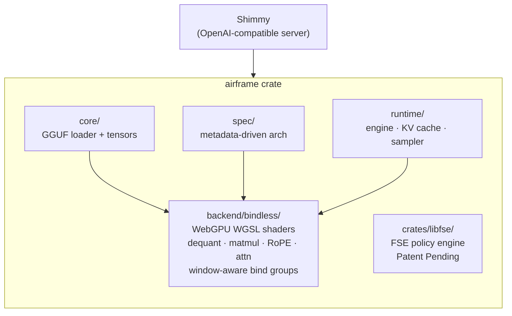

<div align="center">
  

  ### Pure-Rust WebGPU Inference Engine for GGUF Models

  [](https://crates.io/crates/airframe)
  [](https://github.com/Michael-A-Kuykendall/airframe/actions/workflows/ci.yml)
  [](LICENSE)
  [](https://rustup.rs/)
  [](https://github.com/Michael-A-Kuykendall/airframe/stargazers)
  [](https://github.com/Michael-A-Kuykendall/shimmy)

  **No C++ toolchain. No Python. No llama.cpp. Just Rust and your GPU.**
</div>

Airframe is independently maintained and free forever. [Sponsorship](https://github.com/sponsors/Michael-A-Kuykendall) funds certification, compatibility work, and releases.

---

Airframe is the GPU inference core powering [Shimmy](https://github.com/Michael-A-Kuykendall/shimmy). It runs full transformer inference directly on the GPU via WGSL compute shaders — works on NVIDIA, AMD, Intel, integrated GPUs, and Apple Silicon.

**What's new:** Certification pipeline consolidated into a clean 3-box regimen (MATH + INFERENCE + DETERMINISM) with 26 model/quant combos across 12 families, metadata-driven architecture (norm/gating derived from GGUF tensor presence, not arch strings), TurboShimmy `TURBO_KV=int4` opt-in for large models, and window-aware bind groups enabling >8-slot tensor spans. See [CHANGELOG.md](CHANGELOG.md) for the full version history.

```toml
[dependencies]
airframe = "0.4"
```

> **Patent Notice**: The Fused Semantic Execution (FSE) subsystem (`crates/libfse`) is covered by a pending US patent. The WebGPU inference runtime (attention, GGUF loader, quantization) is unencumbered MIT. See [license section](#license) for full terms.

---

## Why Airframe?

Most Rust LLM inference libraries are thin wrappers around llama.cpp — they require a C++ toolchain, link against native libraries, and make cross-compilation painful. Airframe is different:

| | Airframe | llama.cpp bindings |
|---|---|---|
| Build toolchain | `cargo build` | C++ compiler required |
| GPU backend | WebGPU (wgpu) — NVIDIA, AMD, Intel, integrated | CUDA / Metal / Vulkan |
| Cross-compilation | Native Rust | Complex |
| Determinism | Guaranteed per-configuration | Platform-dependent |
| Dependency count | Minimal | Large C++ dep tree |
| `cargo publish` friendly | ✅ | ❌ |

---

## Quick Start

```rust
use airframe::runtime::gpu::{GpuRuntime, SamplingParams};

#[tokio::main]
async fn main() -> Result<(), Box<dyn std::error::Error>> {
    let runtime = GpuRuntime::load("path/to/model.gguf").await?;
    let output = runtime
        .generate("The capital of France is", SamplingParams::default(), None)
        .await?;
    println!("{}", output);
    Ok(())
}
```

See [`examples/`](examples/) for tokenizer and GPU probe examples, and the full inference path in the [Shimmy](https://github.com/Michael-A-Kuykendall/shimmy) server.

---

## Supported Architectures

| Architecture | Models | Status |
|---|---|---|
| **Llama** | Llama 3.2, Llama 3.1, Llama 3, Llama 2, TinyLlama, DeepSeek | ✅ Certified |
| **Mistral** | Mistral 7B, Ministral-3-14B, Mixtral (dense layers) | ✅ Certified |
| **Phi** | Phi-3.5, Phi-3-mini, Phi-2 | ✅ Certified |
| **Qwen2** | Qwen2 0.5B, 1.5B, 7B | ✅ Certified |
| **Qwen3** | Qwen3 0.6B–8B + 4B-Thinking | ✅ Certified (QK-norm, head_dim=128) |
| **Qwen3.5** | Qwen3.5-9B | ✅ Certified |
| **Gemma2** | Gemma-2 2B, 9B | ✅ Certified |
| **Gemma4** | Gemma-4 E4B, 12B-coder | ✅ Certified |
| **StarCoder2** | StarCoder2 3B | ✅ Certified |
| **Ministral** | Ministral-3-14B-Reasoning | ✅ Certified |
| **DeepSeek-R1** | DeepSeek-R1-0528-Qwen3-8B | ✅ Certified |
| **GPT-2** | GPT-2 | ✅ Supported |

See [docs/SUPPORTED_MODELS.md in shimmy](https://github.com/Michael-A-Kuykendall/shimmy/blob/main/docs/SUPPORTED_MODELS.md) for the full certified-model matrix.

> **Note on large models:** We support models up to 8B+ parameters and >4GiB GGUF files. However, not all supported models can be certified locally — very large models may exceed available GPU memory or require the `plan_layer_half_windows` tensor-scatter fix (the `dgd` epic, coming in v0.5.0). Certification coverage is prioritized by model popularity and quant type importance.

## Supported Quantization

`F32` · `F16` · `Q4_0` · `Q5_0` · `Q8_0` · `Q4_K` · `Q5_K` · `Q6_K`

All quantization types are implemented in both GPU shader and CPU reference paths, validated by `quant_verify` (GPU/CPU dequant consistency) and per-layer certification — the same model produces numerically consistent output on CPU and GPU, within numerical tolerance.

---

## Architecture

Airframe is built around three principles:

### 1. Bindless WebGPU Pipeline

The GPU backend uses a bindless resource model — all weight tensors are uploaded once to GPU memory and addressed by index in the shader, eliminating per-layer bind group churn. This gives near-linear throughput scaling with context length.

### 2. Fused Semantic Execution (FSE)

The policy enforcement layer (`crates/libfse`) compiles multiple independent semantic rules into a single fused DFA evaluated during token generation. Rule evaluation cost is **O(1) in rule count** for shared selectors — a property that is not an optimization but an architectural inversion.

```
Input stream → Compiled DFA → Fused opcode table → Fail-closed decision
                                (single pass)
```

See [`crates/libfse/README.md`](crates/libfse/README.md) for the full technical specification, patent notice, and architecture.

### 3. Deterministic Sampling

Given the same model file, seed, sampling parameters, and GPU/configuration, Airframe produces identical output on every run — across restarts and machines. This makes it suitable for reproducible evaluation pipelines.

---

## Design Diagrams



**Text version:**

```
Shimmy (server) → airframe (engine)
                              │
          ┌───────────────────┼───────────────────┐
          ▼                   ▼                   ▼
   core/ (GGUF)        spec/ (metadata)     runtime/ (engine)
          │                   │                   │
          └───────────────────┴───────────────────┘
                              ▼
              backend/bindless/ (WebGPU shaders)
                              │
                              ▼
                crates/libfse/ (FSE policy)
```

Full architecture reference: [`docs/architecture-map.md`](docs/architecture-map.md)

---

## ⚡ TurboShimmy INT4 KV Cache

TurboShimmy is Airframe's on-GPU INT4 KV-cache compression system. It squeezes the KV cache from 32-bit floats down to per-head-vector 4-bit integers — entirely in WGSL compute shaders with no CPU roundtrips — delivering ~7× less KV VRAM with no measurable quality loss at normal context lengths.

**One env var. ~7× less KV VRAM. Same output quality. Pure Rust, pure GPU.**

```bash
# Enable TurboShimmy (in the Shimmy server)
SHIMMY_KV_QUANT=int4 SHIMMY_MAX_CTX=8192 /path/to/shimmy serve

# Or with the prefill-chunk flag (prevents Windows TDR resets on long prompts)
SHIMMY_KV_QUANT=int4 SHIMMY_PREFILL_CHUNK=8 SHIMMY_MAX_CTX=8192 /path/to/shimmy serve
```

**Why it matters** — TurboShimmy changes what fits on consumer GPUs:

| GPU VRAM | Without TurboShimmy | With TurboShimmy |
|---|---|---|
| 3 GB | Llama-3.2-1B only | **Llama-3.2-3B fits ✅** |
| 4 GB | Llama-3.2-3B, ctx=2048 (tight) | **Llama-3.2-3B at ctx=8192 ✅** |
| 6 GB | 3B models, short context | **7B models with reasonable context ✅** |

**VRAM savings (ctx=2048):**

| Model | F32 KV | INT4 KV | Savings |
|---|---|---|---|
| TinyLlama 1.1B (Q4_0) | 88 MB | ~13 MB | **~7× less** |
| Llama-3.2-1B (Q4_K_M) | ~128 MB | ~18 MB | **~7× less** |
| Llama-3.2-3B (Q4_K_M) | ~512 MB | ~72 MB | **~7× less** |

**How it works:** Each K/V head vector is independently quantized to 4-bit integers with a per-vector F32 scale factor (`max_abs / 7.0`), packed into U32s (8 nibbles each) by `sh_kv_pack_int4.wgsl`. Dequantization via `sh_kv_unpack_int4.wgsl` happens on-the-fly before each attention computation. The helical context-shift operates directly on the packed INT4 representation — no decompression needed. Zero CPU roundtrips throughout.

**Quality validation:** Needle-in-a-haystack benchmarks on Llama-3.2-3B show zero retrieval degradation vs F32 at ctx≤2048 across all tested insertion depths (15%, 50%, 85%). See [`docs/turboshimmy.md`](docs/turboshimmy.md) and the [Shimmy wiki TurboShimmy page](https://github.com/Michael-A-Kuykendall/shimmy/wiki/TurboShimmy) for full benchmark data and setup guide.

**Server environment variables**:

| Variable | Default | Description |
|---|---|---|
| `SHIMMY_BASE_GGUF` | *(required)* | Path to `.gguf` model file |
| `SHIMMY_PORT` | `11435` | HTTP listener port |
| `SHIMMY_MAX_CTX` | `2048` | Maximum context window (tokens) |
| `SHIMMY_PREFILL_CHUNK` | `64` | Prefill batch size; reduce to `8` if you see TDR crashes on Windows |
| `SHIMMY_KV_QUANT` | `f32` | KV cache mode: `f32` or `int4` (TurboShimmy) |
| `SHIMMY_VRAM_LIMIT_MB` | `10500` | VRAM budget warning threshold (MB); tune for your GPU |

---

## Benchmarks

Airframe has been validated on standard LLM evaluation benchmarks. Results are tracked in [`artifacts/`](artifacts/).

The FSE policy layer benchmarks 27% faster than raw `aho-corasick` iterator on 7KB payloads (see `crates/libfse/AUDIT_INFO.md` for methodology).

To run performance baselines:

```bash
cargo bench
# or with a model (via Shimmy):
/path/to/shimmy generate --model-path /path/to/model.gguf --prompt "Hello"
```

---

## Development

```bash
git clone https://github.com/Michael-A-Kuykendall/airframe
cd airframe
cargo build
cargo test
```

See [CONTRIBUTING.md](CONTRIBUTING.md) for guidelines. See [CHANGELOG.md](CHANGELOG.md) for release history.

---

## Ecosystem

| Project | Description |
|---|---|
| [**Shimmy**](https://github.com/Michael-A-Kuykendall/shimmy) | OpenAI-compatible inference server — powered by Airframe |
| [**libfse**](https://crates.io/crates/libfse) | Fused Semantic Execution policy engine — ships as part of this repo |
| [**shimmytok**](https://crates.io/crates/shimmytok) | GGUF-native tokenizer used by both Airframe and Shimmy |
| [**shimmyjinja**](https://github.com/Michael-A-Kuykendall/shimmyjinja) | Pure-Rust Jinja2 engine for HuggingFace `chat_template` strings — **live in v0.1.1**, powers the prompt rendering pipeline |

---

## Sponsor Airframe

- **$5/month**: Coffee tier ☕ — Sponsor badge + name in [SPONSORS.md](SPONSORS.md)
- **$25/month**: Supporter 🐛 — Priority support + name in [SPONSORS.md](SPONSORS.md)
- **$100/month**: Corporate backer 🏢 — Logo placement + release recognition
- **$500/month**: Enterprise partner 🚀 — Office hours + roadmap consultation

**Current sponsors:** [ZephyrCloudIO](https://github.com/ZephyrCloudIO) · [gqf2008](https://github.com/gqf2008) · [alistairheath](https://github.com/alistairheath)

[**🎯 Become a Sponsor**](https://github.com/sponsors/Michael-A-Kuykendall)

---

## License

MIT — see [LICENSE](LICENSE).

**Inference runtime** (attention kernels, GGUF loader, quantization, WebGPU backend): unencumbered MIT.

**FSE subsystem** (`crates/libfse`): MIT for non-commercial use. The Fail-Closed Policy Fusion and Execution Kernel methods are covered by a pending US patent. Commercial embedding requires a separate license — contact michaelallenkuykendall@gmail.com.

---

<sup>Trans rights are human rights. Airframe is built by and for everyone — discrimination has no place in our community or our code.</sup>
