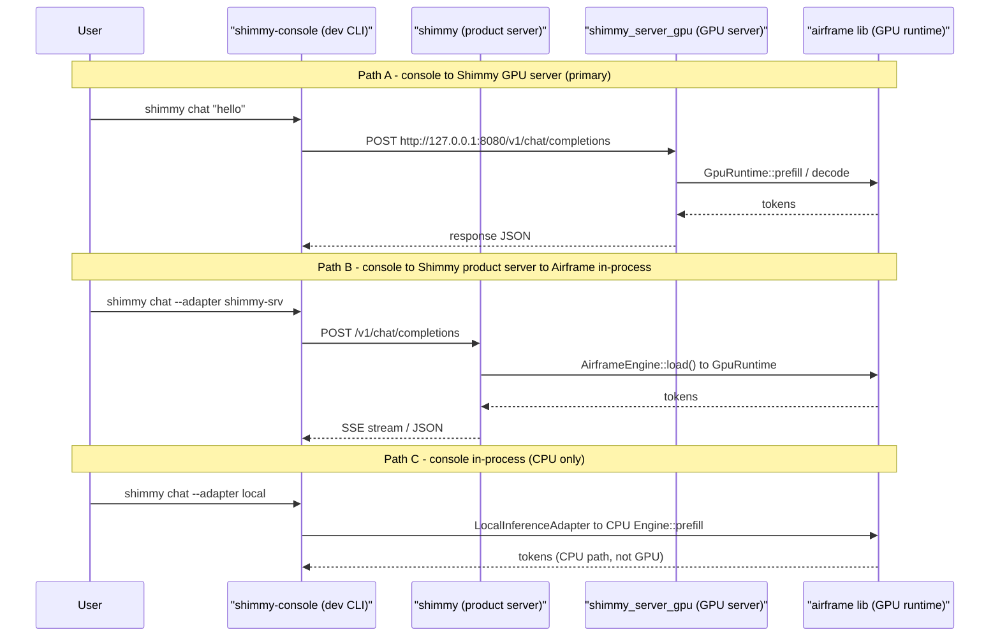
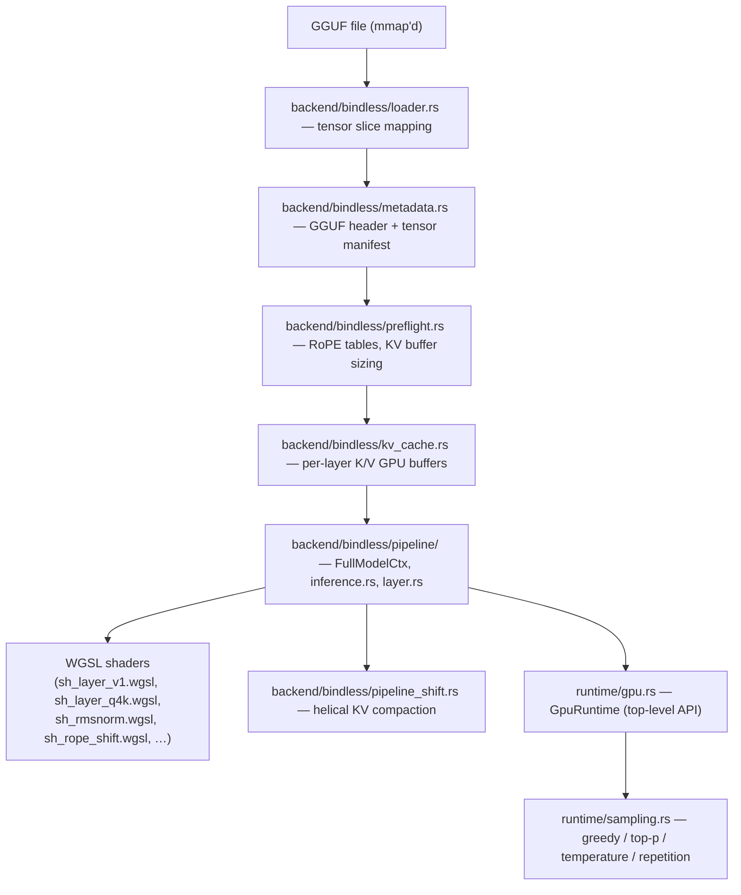

# Architecture Map

Two separate applications live in this workspace. They share the `airframe` library as a common engine but otherwise have different surfaces, audiences, and completion states.

---

## High-Level Topology

```mermaid
flowchart TB
    subgraph "airframe (private GPU engine library)"
        LIB["airframe crate (src/lib.rs)"]
        CORE["core/ — GGUF loading, tensors, weight IDs, spec, dequant"]
        FAMILY["family/llama.rs — CPU Llama forward pass"]
        OPS["ops/ — reference CPU ops (attention, FFN, RoPE, RMSNorm…)"]
        RUNTIME["runtime/ — engine, KV cache, sampler, multi-token engine"]
        BACKEND["backend/bindless/ — WebGPU compute pipeline"]
        WGSL["WGSL shaders (14 files) — dequant, layer, matmul, RoPE, RMSNorm…"]
        CONTROL["control / fse_control / schoolmarm — policy / grammar gating"]
        VALIDATION["validation/ — evidence checklists, oracle conformance, artifacts"]

        LIB --> CORE
        LIB --> FAMILY
        LIB --> OPS
        LIB --> RUNTIME
        LIB --> BACKEND
        LIB --> CONTROL
        LIB --> VALIDATION
        BACKEND --> WGSL
    end

    subgraph "shimmy_server_gpu (Airframe GPU server binary)"
        SRV["src/bin/shimmy_server_gpu.rs — HTTP listener, job queue"]
        SRV_INF["src/bin/shimmy_server_gpu/server_inference.rs — inference loop"]
        SRV_EVAL["src/bin/shimmy_eval.rs — wikitext2 / LAMBADA eval tasks"]
        DIAG["src/bin/frontier_compare.rs + layer_dump_gpu.rs + quant_verify.rs — diagnostics"]

        SRV --> SRV_INF
        SRV --> SRV_EVAL
        SRV --> DIAG
        SRV_INF --> BACKEND
        SRV_INF --> RUNTIME
    end

    subgraph "shimmy_integration (Shimmy product server — shimmy_integration/)"
        SHIMMY_MAIN["src/main.rs — CLI entry, AppState"]
        SHIMMY_CLI["src/cli.rs — clap serve/list/discover/pull/chat CLI"]
        SHIMMY_SRV["src/server.rs — Axum router, CORS, health, metrics"]
        SHIMMY_API["src/api.rs — /api/generate, WebSocket /ws"]
        OAI_COMPAT["src/openai_compat/ — /v1/chat/completions, /v1/models"]
        ANTHROPIC["src/anthropic_compat.rs — /v1/messages (Anthropic format)"]
        ENGINE_MOD["src/engine/mod.rs — InferenceEngine + LoadedModel traits"]
        AF_ENGINE["src/engine/airframe.rs — AirframeEngine (in-process GPU)"]
        ADAPTER_ENG["src/engine/adapter.rs — llama.cpp adapter"]
        DISCOVERY["src/discovery.rs — GGUF + SafeTensors path scanner"]
        AUTO_DISC["src/auto_discovery/ — Ollama manifest scanner"]
        TEMPLATES["src/templates.rs — chat template formatting per arch"]
        PORT_MGR["src/port_manager.rs — ephemeral port allocation"]

        SHIMMY_MAIN --> SHIMMY_CLI
        SHIMMY_MAIN --> SHIMMY_SRV
        SHIMMY_SRV --> SHIMMY_API
        SHIMMY_SRV --> OAI_COMPAT
        SHIMMY_SRV --> ANTHROPIC
        SHIMMY_API --> ENGINE_MOD
        OAI_COMPAT --> ENGINE_MOD
        ENGINE_MOD --> AF_ENGINE
        ENGINE_MOD --> ADAPTER_ENG
        AF_ENGINE --> LIB
        SHIMMY_MAIN --> DISCOVERY
        SHIMMY_MAIN --> AUTO_DISC
    end

    subgraph "shimmy-console (Shimmy CLI dev tool — crates/console/)"
        CON_MAIN["src/main.rs — clap chat/analyze/edit/config/license/tool"]
        CON_CMDS["src/commands/ — chat, analyze, edit, config, sessions, model, license"]
        CON_ADAPT["src/adapters/ — HTTP, WebSocket, Local (in-process), Mock, Shimmy server"]
        CON_WS["src/websocket/ — InferenceBackend trait + client"]
        CON_TOOLS["src/tools/ — file_ops, git, command, analysis, docs, image, system, loader"]
        CON_HIST["src/history.rs — SQLite WAL history storage"]
        CON_SESS["src/session_store.rs — session state"]
        CON_LIC["src/license/ — license validation"]
        CON_PLUG["src/plugins.rs — plugin registry"]

        CON_MAIN --> CON_CMDS
        CON_CMDS --> CON_ADAPT
        CON_CMDS --> CON_TOOLS
        CON_ADAPT --> CON_WS
        CON_ADAPT --> LIB
    end

    CON_ADAPT -- "HTTP POST /v1/chat/completions (ShimmyServerAdapter)" --> SHIMMY_SRV
    CON_ADAPT -- "HTTP POST / (ShimmyServerAdapter legacy)" --> SRV
    CON_ADAPT -- "in-process (LocalInferenceAdapter)" --> LIB
    SHIMMY_SRV -- "or direct to Airframe GPU server" --> SRV
```



---

## Application 1: `shimmy_server_gpu` (Airframe GPU Server)

**Location:** `src/bin/shimmy_server_gpu.rs` + `src/bin/shimmy_server_gpu/`

**What it is:** A single-threaded async HTTP server that runs one GGUF model on WebGPU and exposes an Airframe-specific job-queue API. This is the inference workhorse. It is the only binary that directly operates the GPU pipeline.

**Completion:** Functionally complete and validated for TinyLlama, Llama-3.2-1B/3B, Phi-2, Gemma-2-2B (with caveats), starcoder2-3b. Stable gate-pass status.

### Endpoints

| Route | Method | Purpose |
|-------|--------|---------|
| `/` | POST | Submit an inference job; returns `job_id` |
| `/api/repro/queue` | GET | Queue state (readiness check) |
| `/api/repro/job-status` | GET | Poll job by `job_id` |
| `/api/repro/job-stream` | GET | Chunked streaming for a completed/in-progress job |
| `/v1/chat/completions` | POST | OpenAI-compatible chat completions |
| `/v1/models` | GET | Registered model list |

### Request surface (InferenceRequest)

```
task, prompt, session_id, prompt_mode, max_tokens, min_tokens (reserved),
ignore_eos, temperature, top_p, repetition_penalty, seed, stream,
expose_candidate, debug_trace_path, debug_trace_full, debug_trace_start_step,
debug_trace_max_steps, debug_trace_include_prefill
```

### Prompt modes

| Mode | Template | Notes |
|------|----------|-------|
| `creative` | TinyLlama legacy `<|system|>` format | Default; bit-perfect repro baseline |
| `creative-chatml` | ChatML `<\|im_start\|>` | Alt creative path |
| `raw` | None (verbatim passthrough) | |
| `developer` | ChatML + Rust-code system prompt | Grammar/sanitizer/compile-check active |

### Stop reasons

`max_tokens`, `eos`, `im_end`, `grammar_reject`, `grammar_accept`, `end_marker`

### Known issues / caveats

| Item | File | Issue |
|------|------|-------|
| `send_error()` is dead code | `shimmy_server_gpu.rs:1394` | TODO to promote to async + TcpStream; streaming error path not wired |
| `min_tokens` field reserved but not consumed | `shimmy_server_gpu.rs:280` | Doc comment says "reserved for future request throttling" |
| `StreamTokenEvent` / `StreamDoneEvent` structs unused | `shimmy_server_gpu.rs:351,359` | SSE structs for future streaming — not yet active |
| Q6_K output head workaround (Phase 4E) at line 483 | `shimmy_server_gpu.rs:483` | Inline comment names it a workaround; still in place |

---

## Application 2: `shimmy` (Shimmy Product Server)

**Location:** `shimmy_integration/src/`

**What it is:** The public-facing Shimmy product binary — an OpenAI-compatible HTTP server with model auto-discovery, an Ollama-compatible model list, CORS, health/metrics endpoints, and a CLI. It uses Airframe as one of its engine backends.

**Completion:** Server, routing, and OpenAI-compat are functional. Airframe in-process engine integration (`engine/airframe.rs`) is wired and compiles. Several planned-future surfaces (tool endpoints, universal model routing, MLX) are scaffolded but dead.

### CLI commands (`src/cli.rs`)

| Command | Purpose |
|---------|---------|
| `serve` | Start HTTP server (auto or manual bind, optional `--model-path`) |
| `list` | Show registered + discovered models |
| `discover` | Rescan model directories |
| `pull` | (Planned) HuggingFace model download |
| `chat` | Interactive chat in terminal |
| `--legacy` | Force CPU adapter instead of Airframe GPU |
| `--gpu-backend` | Select backend: auto/cpu/cuda/vulkan/opencl |
| `--cpu-moe` / `--n-cpu-moe` | MoE offload flags |

### API endpoints (`server.rs` + `api.rs` + `openai_compat/`)

| Route | Method | Purpose | Status |
|-------|--------|---------|--------|
| `/health` | GET | Health + model count | Active |
| `/metrics` | GET | Model inventory + perf stats | Active |
| `/v1/chat/completions` | POST | OpenAI chat completions (streaming + non-streaming) | Active |
| `/v1/models` | GET | OpenAI model list | Active |
| `/api/tags` | GET | Ollama-compatible model list | Active |
| `/api/generate` | POST | Raw generate (Ollama-style) | Active |
| `/v1/messages` | POST | Anthropic-compatible messages | Active |
| `/ws` | WebSocket | Token streaming | Active |
| `/diag` | GET | Diagnostic dump | Active |
| `/tools/call` | POST | Tool execution (future) | **Dead — route stub only** |
| `/tools/execute` | POST | Tool execution (future) | **Dead — route stub only** |
| `/workflows/run` | POST | Workflow execution (future) | **Dead — route stub only** |

### Engine backends (`src/engine/`)

| File | Engine | Status |
|------|--------|--------|
| `airframe.rs` | `AirframeEngine` — in-process GPU via `GpuRuntime` | **Wired and active** |
| `adapter.rs` | llama.cpp adapter (legacy CPU path) | Active (legacy) |
| `huggingface.rs` | HuggingFace via `feature = "huggingface"` | Feature-gated; not compiled by default |
| `mlx.rs` | Apple MLX backend | Scaffolded; `#[allow(dead_code)]` throughout |
| `safetensors_native.rs` | Native SafeTensors loading | Scaffolded; `#[allow(dead_code)]` throughout |
| `universal.rs` | Universal routing layer | **Dead — `#[allow(dead_code)]`, future routing; not wired** |

### Known issues

| Item | File | Issue |
|------|------|-------|
| `ensure_model_exists()` hardcodes port 11435 | `shimmy_integration/src/` (not used directly here) | Shimmy uses ephemeral ports; function is skipped |
| `/tools/call`, `/tools/execute`, `/workflows/run` are stubs | `api.rs:385,392,404` | Route bodies exist but are not registered in the router |
| `UniversalEngine` / `UniversalModel` are future routing stubs | `engine/universal.rs` | Not wired into `main.rs` dispatch |
| MLX and SafeTensors engines have pervasive `#[allow(dead_code)]` | `engine/mlx.rs`, `engine/safetensors_native.rs` | Scaffolded only |
| `port_manager.rs` has 7 bare `#[allow(dead_code)]` suppresses | `port_manager.rs:15,27,91,101,107,112,121` | Several methods are unreachable in current flow |
| `util/memory.rs` — entire file is stubs | `util/memory.rs` | 8x `"Placeholder utility for future use"` suppressions |
| Version check hard-exits on `0.1.0` with a public GitHub URL | `main.rs:57` | Private-engine binary should not reference a public repo URL |

---

## Application 3: `shimmy-console` (Development CLI)

**Location:** `crates/console/src/`

**What it is:** A standalone CLI tool intended for developer use: chat with the model in a terminal, invoke tools (file ops, git, shell commands, image reading), manage configuration and sessions. It is the foundation for future agentic behaviors.

**Completion:** CLI skeleton, tool registry, adapters, and history storage are structurally sound. The `chat` command is functional against a running Shimmy GPU server. Session persistence, model selection persistence, license gating, and several commands are incomplete or stub-only.

### CLI commands (`src/main.rs` + `src/commands/`)

| Command | File | Status |
|---------|------|--------|
| `chat` | `commands/chat.rs` | **Works** — connects to Shimmy GPU server at `127.0.0.1:8080`, tool-call dispatch loop |
| `analyze` | `commands/analyze.rs` | **Skeleton** — struct exists, `run()` not fully implemented |
| `edit` | `commands/edit.rs` | **Skeleton** |
| `config` | `commands/config.rs` | **Skeleton** |
| `license` | `commands/license.rs` | **Partial** — license validation wired but has dev backdoors (see below) |
| `tool <name>` | `main.rs` | **Works** — dispatches any registered tool by name |
| `model set` / `model show` | `commands/model.rs` | **Broken** — `set_model` mutates a local `Config` but never calls `config.save()`. Selection is lost on restart. |
| `sessions` | `commands/sessions.rs` | Exists but state unclear |

### Tool registry (`src/tools/`)

| Tool | File | Status |
|------|------|--------|
| `file_ops` | `tools/file_ops.rs` | Active |
| `git` | `tools/git.rs` | Active |
| `command` | `tools/command.rs` | Active — runs shell commands |
| `analysis` | `tools/analysis.rs` | Active |
| `docs` | `tools/docs.rs` | Active |
| `read_image` | `tools/image.rs` | Active — base64 + MIME + dimensions; `ocr` mode advertised but unimplemented |
| `system` | `tools/system.rs` | Active |
| `loader` | `tools/loader.rs` | Active |

### Inference adapters (`src/adapters/`)

| Adapter | Connects to | Status |
|---------|------------|--------|
| `ShimmyServerAdapter` | Shimmy GPU server via HTTP | **Primary path; used by `chat` command** |
| `HttpInferenceAdapter` | Generic OpenAI-compat HTTP endpoint | Active |
| `WsInferenceAdapter` | WebSocket endpoint | Active |
| `LocalInferenceAdapter` | In-process Airframe CPU engine (via `airframe` lib) | Wired; uses CPU `Engine` not `GpuRuntime` |
| `MockInferenceAdapter` | Deterministic mock for tests | Active |

### Known issues

| Item | File | Issue |
|------|------|--------|
| **`set_model` does not persist** | `commands/model.rs:12,26` | Doc says "persists to user config." It doesn't. `Config::save()` is never called. Restart loses selection. |
| `ensure_model_exists()` targets hardcoded port 11435 | `commands/model.rs:5,22` | The FIXME is accurate: skipped in real flow. Function is dead in practice. |
| License validator has two dev backdoors with explicit TODO | `license/validator.rs:70,80` | `"TODO: REMOVE BEFORE PRODUCTION"` — both are still present |
| `ChatCommand` has hardcoded model path fallback | `commands/chat.rs:22` | `"D:/shimmy-test-models/..."` hardcoded as default model string; will break on any other machine |
| `LocalInferenceAdapter` uses CPU `Engine`, not `GpuRuntime` | `adapters/local_adapter.rs` | In-process path bypasses the GPU pipeline entirely; behavior differs from server path |
| `history.rs` doc claims "No lock file issues / Zero lock cleanup needed" | `history.rs:61,62` | WAL mode does not guarantee this unconditionally; claim is overstated |
| `read_image` OCR mode advertised in description but not implemented | `tools/image.rs` | Returns error if `mode=ocr` is attempted |
| `docs_tests.rs` has a single TODO placeholder | `tools/docs_tests.rs:9` | `"TODO: Add tests for documentation tools when implemented"` |

---

## How the Three Connect



---

## GPU Pipeline Stack (Airframe Library)



---

## What Is Complete vs. Incomplete

### Complete and validated

- Airframe GPU engine: GGUF load, WebGPU bindless pipeline, per-token decode, KV cache, helical shift, multi-model support
- `shimmy_server_gpu` HTTP API: job queue, streaming, OpenAI-compat chat completions
- `shimmy` product server: OpenAI-compat, Ollama-compat, Anthropic-compat, health/metrics, Axum router, CORS
- `shimmy` → Airframe in-process engine bridge (`engine/airframe.rs`)
- `shimmy-console` chat loop (against GPU server)
- Tool registry: file_ops, git, command, analysis, docs, image (base64/meta modes), system, loader
- SQLite history storage
- `cargo clippy -- -D warnings` clean; `cargo test` 324 passed / 0 failed

### Partial / scaffolded

- `shimmy-console` commands: analyze, edit, config — skeletons, not implemented
- `shimmy-console` model persistence — function broken (never saves)
- `shimmy` universal engine routing — struct exists, not wired
- `shimmy` tool and workflow routes — stubs registered only
- `shimmy` MLX and SafeTensors native engines — dead code
- `read_image` OCR mode — described but not implemented
- License validation — wired but two dev backdoors present with explicit TODO-remove markers
- Vision API — `read_image` tool reads and encodes images; no multimodal inference path exists yet

### Future / planned but not started

- Vision inference pipeline (multimodal GGUF, visual tokens)
- CLI `pull` command (HuggingFace download)
- SSE streaming error path (`send_error` → async)
- Console `--adapter shimmy-srv` flag (currently hardcoded to `ShimmyServerAdapter`)
- Telemetry / tracing (`println!` → `tracing::info!` migration deferred post-v2.0)
- `ensure_model_exists()` with ephemeral port support
- `read_image` OCR mode

---

## Where to Extend for Vision API and Agentic Products

### Vision API path

The `read_image` tool in `crates/console/src/tools/image.rs` is the natural anchor. Current state: reads file, decodes dimensions, returns base64. To add vision inference:

1. Add a `VisionInferenceAdapter` to `crates/console/src/adapters/`
2. Wire a multimodal GGUF engine (LLaVA-style) into `shimmy_integration/src/engine/`
3. Add a `/v1/chat/completions` multimodal content-block parser in `shimmy_integration/src/openai_compat/`
4. Activate OCR mode in `read_image` (currently advertised but not implemented)

### Agentic product path

The `chat` command already has a tool-call dispatch loop. The gaps are:

1. `analyze` and `edit` commands need implementations
2. Model selection needs to actually persist (`set_model` bug)
3. Session continuity needs the `SessionStore` wired into the chat loop
4. Tool call results need to feed back into the context window (partially handled in `chat.rs` loop, but incomplete)
