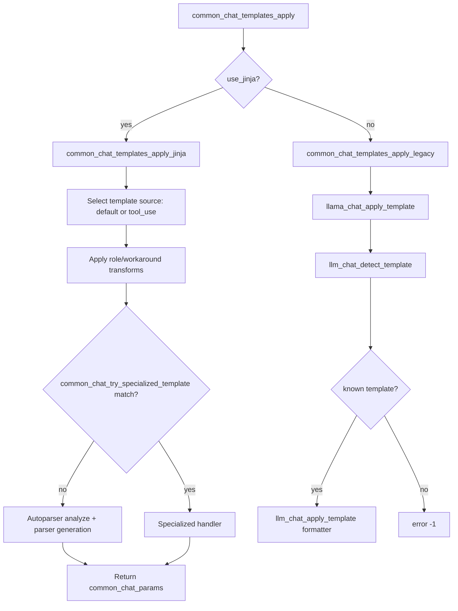

# Llama.cpp Family Decision Tree Spike (2026-06-04)

## Purpose

Capture the current llama.cpp template-family decisioning tree, compare it against Airframe's prompt-family routing, and define a practical linkage with formula-lens so disconnects are visible quickly.

## Source Snapshot

- Upstream repo: `ggml-org/llama.cpp` (master as of 2026-06-04)
- Primary files reviewed:
  - `src/llama-chat.h`
  - `src/llama-chat.cpp`
  - `common/chat.h`
  - `common/chat.cpp`

## Executive Contrast

- llama.cpp has two major routes:
  - Jinja route (`common/chat.cpp`) with specialized handlers plus auto parser generation.
  - Legacy route (`src/llama-chat.cpp`) that detects known templates heuristically and applies hard-coded formatting.
- Airframe currently has:
  - Embedded Jinja route when `tokenizer.chat_template` exists.
  - Small fallback family switch (`TinyLlama`, `ChatML`, `Llama3`, `Gemma2`, `MiniCpmV`, `Completion`) when no embedded template exists.
- Key implication: llama.cpp supports a much broader family matrix and has richer guardrails for unknown/edge templates.

## Full Decision Tree (llama.cpp)



## Route A: Jinja Pipeline Details

1. Initialize templates via `common_chat_templates_init`.
2. Prefer model metadata template(s): default and optional `tool_use` variant.
3. If none found, fallback to CHATML source.
4. Build `autoparser::generation_params` including:
   - `messages`, `tools`, `tool_choice`
   - `reasoning_format`, `enable_thinking`
   - `add_generation_prompt`, `chat_template_kwargs`
5. Apply compatibility workarounds (developer role remap, unsupported system role merge, argument normalization, etc.).
6. Specialized template detection (`common_chat_try_specialized_template`) before generic parser generation.
7. If no specialized match, use differential autoparser for parser/grammar synthesis.

## Route A Specialized Families

Detected in `common_chat_try_specialized_template`:

- Ministral/Magistral Large 3
- GPT-OSS
- Functionary v3.2
- Kimi K2 Thinking
- LFM2
- LFM2.5
- GigaChatV3
- DeepSeek V3.2
- Gemma4

These handlers add family-specific parser and grammar behavior (tools, reasoning tags, continuation handling, etc.).

## Route B: Legacy Heuristic Family Detection

Legacy detection and formatting happen through:

- `llm_chat_detect_template`
- `llm_chat_apply_template`

If detection fails: returns `LLM_CHAT_TEMPLATE_UNKNOWN` and the public API returns an error.

## Full Built-in Legacy Family Catalog

From `LLM_CHAT_TEMPLATES` map in `src/llama-chat.cpp`:

| Key | Enum |
|---|---|
| `chatml` | `LLM_CHAT_TEMPLATE_CHATML` |
| `llama2` | `LLM_CHAT_TEMPLATE_LLAMA_2` |
| `llama2-sys` | `LLM_CHAT_TEMPLATE_LLAMA_2_SYS` |
| `llama2-sys-bos` | `LLM_CHAT_TEMPLATE_LLAMA_2_SYS_BOS` |
| `llama2-sys-strip` | `LLM_CHAT_TEMPLATE_LLAMA_2_SYS_STRIP` |
| `mistral-v1` | `LLM_CHAT_TEMPLATE_MISTRAL_V1` |
| `mistral-v3` | `LLM_CHAT_TEMPLATE_MISTRAL_V3` |
| `mistral-v3-tekken` | `LLM_CHAT_TEMPLATE_MISTRAL_V3_TEKKEN` |
| `mistral-v7` | `LLM_CHAT_TEMPLATE_MISTRAL_V7` |
| `mistral-v7-tekken` | `LLM_CHAT_TEMPLATE_MISTRAL_V7_TEKKEN` |
| `phi3` | `LLM_CHAT_TEMPLATE_PHI_3` |
| `phi4` | `LLM_CHAT_TEMPLATE_PHI_4` |
| `falcon3` | `LLM_CHAT_TEMPLATE_FALCON_3` |
| `zephyr` | `LLM_CHAT_TEMPLATE_ZEPHYR` |
| `monarch` | `LLM_CHAT_TEMPLATE_MONARCH` |
| `gemma` | `LLM_CHAT_TEMPLATE_GEMMA` |
| `orion` | `LLM_CHAT_TEMPLATE_ORION` |
| `openchat` | `LLM_CHAT_TEMPLATE_OPENCHAT` |
| `vicuna` | `LLM_CHAT_TEMPLATE_VICUNA` |
| `vicuna-orca` | `LLM_CHAT_TEMPLATE_VICUNA_ORCA` |
| `deepseek` | `LLM_CHAT_TEMPLATE_DEEPSEEK` |
| `deepseek2` | `LLM_CHAT_TEMPLATE_DEEPSEEK_2` |
| `deepseek3` | `LLM_CHAT_TEMPLATE_DEEPSEEK_3` |
| `deepseek-ocr` | `LLM_CHAT_TEMPLATE_DEEPSEEK_OCR` |
| `command-r` | `LLM_CHAT_TEMPLATE_COMMAND_R` |
| `llama3` | `LLM_CHAT_TEMPLATE_LLAMA_3` |
| `chatglm3` | `LLM_CHAT_TEMPLATE_CHATGLM_3` |
| `chatglm4` | `LLM_CHAT_TEMPLATE_CHATGLM_4` |
| `glmedge` | `LLM_CHAT_TEMPLATE_GLMEDGE` |
| `minicpm` | `LLM_CHAT_TEMPLATE_MINICPM` |
| `exaone3` | `LLM_CHAT_TEMPLATE_EXAONE_3` |
| `exaone4` | `LLM_CHAT_TEMPLATE_EXAONE_4` |
| `exaone-moe` | `LLM_CHAT_TEMPLATE_EXAONE_MOE` |
| `rwkv-world` | `LLM_CHAT_TEMPLATE_RWKV_WORLD` |
| `granite` | `LLM_CHAT_TEMPLATE_GRANITE_3_X` |
| `granite-4.0` | `LLM_CHAT_TEMPLATE_GRANITE_4_0` |
| `granite-4.1` | `LLM_CHAT_TEMPLATE_GRANITE_4_1` |
| `gigachat` | `LLM_CHAT_TEMPLATE_GIGACHAT` |
| `megrez` | `LLM_CHAT_TEMPLATE_MEGREZ` |
| `yandex` | `LLM_CHAT_TEMPLATE_YANDEX` |
| `bailing` | `LLM_CHAT_TEMPLATE_BAILING` |
| `bailing-think` | `LLM_CHAT_TEMPLATE_BAILING_THINK` |
| `bailing2` | `LLM_CHAT_TEMPLATE_BAILING2` |
| `llama4` | `LLM_CHAT_TEMPLATE_LLAMA4` |
| `smolvlm` | `LLM_CHAT_TEMPLATE_SMOLVLM` |
| `hunyuan-moe` | `LLM_CHAT_TEMPLATE_HUNYUAN_MOE` |
| `gpt-oss` | `LLM_CHAT_TEMPLATE_OPENAI_MOE` |
| `hunyuan-dense` | `LLM_CHAT_TEMPLATE_HUNYUAN_DENSE` |
| `hunyuan-vl` | `LLM_CHAT_TEMPLATE_HUNYUAN_VL` |
| `kimi-k2` | `LLM_CHAT_TEMPLATE_KIMI_K2` |
| `seed_oss` | `LLM_CHAT_TEMPLATE_SEED_OSS` |
| `grok-2` | `LLM_CHAT_TEMPLATE_GROK_2` |
| `pangu-embedded` | `LLM_CHAT_TEMPLATE_PANGU_EMBED` |
| `solar-open` | `LLM_CHAT_TEMPLATE_SOLAR_OPEN` |

Notes:

- `LLM_CHAT_TEMPLATE_DOTS1` exists in enum and heuristic detection, even though it is not exposed in the key map above.
- Heuristic detection can identify templates from token signatures even without explicit key name.

## Airframe Current Family Tree

Current local logic in `src/bin/shimmy_server_gpu.rs`:

1. If GGUF has `tokenizer.chat_template`: use Jinja renderer.
2. Else classify fallback family:
   - Architecture shortcuts:
     - `Phi` -> `Completion`
     - `Gemma` -> `Gemma2`
     - `Qwen2/Qwen3` -> `ChatML`
   - Name/path shortcuts:
     - contains `minicpm` -> `MiniCpmV`
   - Marker scan:
     - Llama3 markers -> `Llama3`
     - Gemma markers -> `Gemma2`
     - ChatML markers -> `ChatML`
     - Tiny markers -> `TinyLlama`
   - Final fallback: `ChatML`

## Compare and Contrast: Key Gaps

1. Coverage width
   - llama.cpp legacy+jinja stack: dozens of families and specialized variants.
   - Airframe fallback stack: 6 families.

2. Unknown behavior
   - llama.cpp legacy route: unknown template returns error.
   - Airframe fallback route: unknown becomes `ChatML`.

3. Specialized control-plane behaviors
   - llama.cpp has template-specific parsing/grammar paths (tool call formats, continuation semantics, thinking tags).
   - Airframe currently uses generic render path and family wrappers.

4. Thinking policy
   - llama.cpp: `enable_thinking` is runtime input and template-aware.
   - Airframe Jinja currently sets `enable_thinking=false` unconditionally.

5. Workarounds and caps
   - llama.cpp uses template capability introspection and compatibility workarounds.
   - Airframe currently has a simpler rendering policy.

## Formula-Lens Linkage: Practical Path

Short answer: yes, this is possible now manually, and can become near-instant with one metadata stamp.

### Manual workflow (works now)

1. Run dual-mode probe per model (`chat` and `raw`) with:
   - `scripts/prompt_mode_formula_probe.sh`
2. Capture renderer logs using:
   - `SHIMMY_DEBUG_PROMPT_RENDER=1`
3. Run formula diff:
   - `scripts/trace_formula_diff.py --golden raw_trace --candidate chat_trace`
4. Join three facts:
   - renderer selection (jinja vs family)
   - rendered prompt string
   - formula divergence score (`mean_score`)

Interpretation rule used in this branch:

- `mean_score` near 0 with same output quality issue => likely not templating.
- non-trivial `mean_score` + prompt differences => likely templating/control-plane contribution.

### Near-instant linkage (recommended small follow-up)

Add these fields into `InferenceTracePackage` at trace creation time:

- `prompt_renderer_mode`: `jinja` or `family`
- `prompt_renderer_family`: fallback family name when `family` mode is used
- `prompt_template_source`: `embedded`, `fallback_arch`, `fallback_marker`, or `fallback_default`

Then extend `trace_formula_diff.py` JSON output with a header block comparing these fields between candidate and golden. This makes prompt-path mismatch visible before reading per-layer deltas.

### Better tool added (low burden)

Use `scripts/template_formula_alignment.py` to compare a trace's renderer decision metadata against a llama.cpp-style inferred family from the rendered prompt text, with optional formula score overlay.

Example:

```bash
python scripts/template_formula_alignment.py \
   --trace artifacts/debug/qwen3_probe_chat/trace_<ts>.json \
   --formula-json artifacts/debug/qwen3_probe_chat/raw_vs_chat_formula.json \
   --json-out artifacts/debug/qwen3_probe_chat/alignment_report.json
```

## Suggested Airframe Follow-up Tasks

1. Add trace metadata stamp for renderer mode/family/source.
2. Gate or soften unconditional Jinja `enable_thinking=false` policy.
3. Add fail-loud telemetry for fallback-to-ChatML cases.
4. Expand fallback family map incrementally based on active model matrix (start with Qwen, StarCoder, DeepSeek, Granite, Gemma4-related behavior cues).
